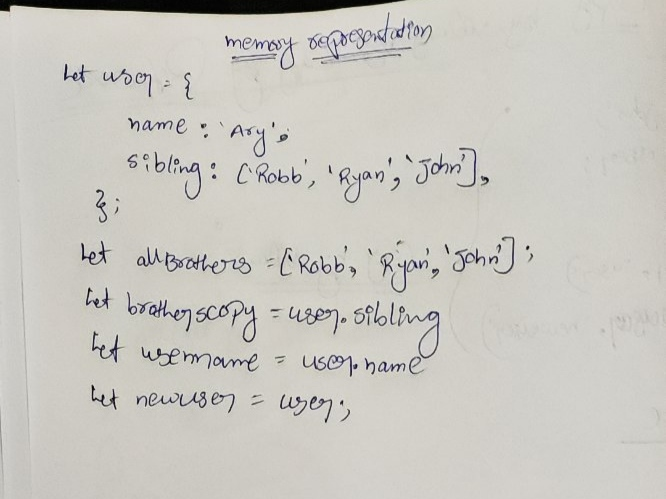

```js
let user = {
  name: 'Arya',
  sibling: ['Robb', 'Ryan', 'John'],
};
let allBrothers = ['Robb', 'Ryan', 'John'];
let brothersCopy = user.sibling;
let usename = user.name;
let newUser = user;
```

1. Memory representation

- Create the memory representation of the above snippet on notebook.
- Take a photo/screenshot and add it to the folder `code`

<!-- To add this image here use  -->

2. Answer the following with reason:

- `user == newUser;` // true because the newUser copy by reference  from user
- `user === newUser;` // true because the newUser copy by reference  from user
- `user.name === newUser.name;`// true because the user.name is copy by reference  form user
- `user.name == newUser.name;` //  true because the user.name is copy by  reference form user
- `user.sibling == newUser.sibling;` //  true becuse the nser.sibling is copy by  reference from user
- `user.sibling === newUser.sibling;` // true becuse the nser.sibling is copy by  reference from user
- `user.sibling == allBrothers;` // false because the user.sibling == allBrothers are not copying by reference from user
- `user.sibling === allBrothers;` //  false because the user.sibling == allBrothers are not copying by reference from user
- `brothersCopy === allBrothers;` // false because the  brothersCopy === allBrothers are not copying by refernce from user
- `brothersCopy == allBrothers;` //  false because the  brothersCopy === allBrothers are not copying by refernce from user
- `brothersCopy == user.sibling;` // true because the brothersCopy == user.sibling are copying by refernce from user
- `brothersCopy === user.sibling;` // true because the brothersCopy == user.sibling are copying by refernce from user
- `brothersCopy[0] === user.sibling[0];` // true because the brothersCopy[0] === user.sibling[0] are copying by refernce from user ueser.sibling[0]
- `brothersCopy[1] === user.sibling[1];` // true because the brothersCopy[1] === user.sibling[1] are copying by refernce from user user.sibling[1]
- `user.sibling[1] === newUser.sibling[1];` // true because the brothersCopy[1] === user.sibling[1] are copying by refernce from user user.sibling[1] 
